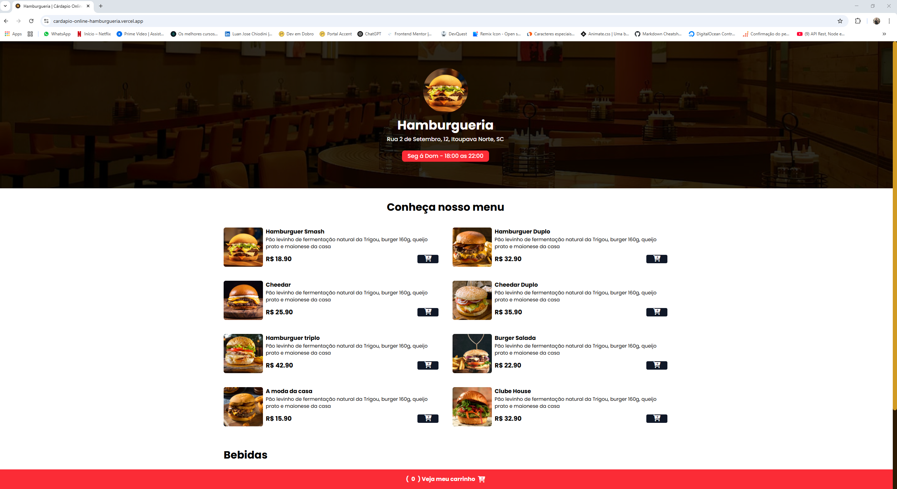

# Hamburgueria | Cardápio Online

O projeto consiste em um cardápio online, onde o usuário escolhe tudo oque vai pedir, adicionando ao carrinho, adiciona seu endereço de destino e quando aperta o botão para finalizar é redirecionado para o WhatsApp do restaurante, com todas as informações do seu pedido.

- Nesse projeto tem verificação para não deixar fazer o pedido se o restaurante estiver fechado

- PopUp personalizado para informar que o restaurante está fechado no momento.

- Projeto responsivo e intuitivo ao usuário.

## Tecnologias, bibliotecas e frameworks utilizados:

-HTML5
-CSS3
-Java Script
-Tailwind
-Figma
-Git
-GitHub
-Toastify js

Referencia: Canal Sujeito Programador (Ótimos vídeos e aulas)
